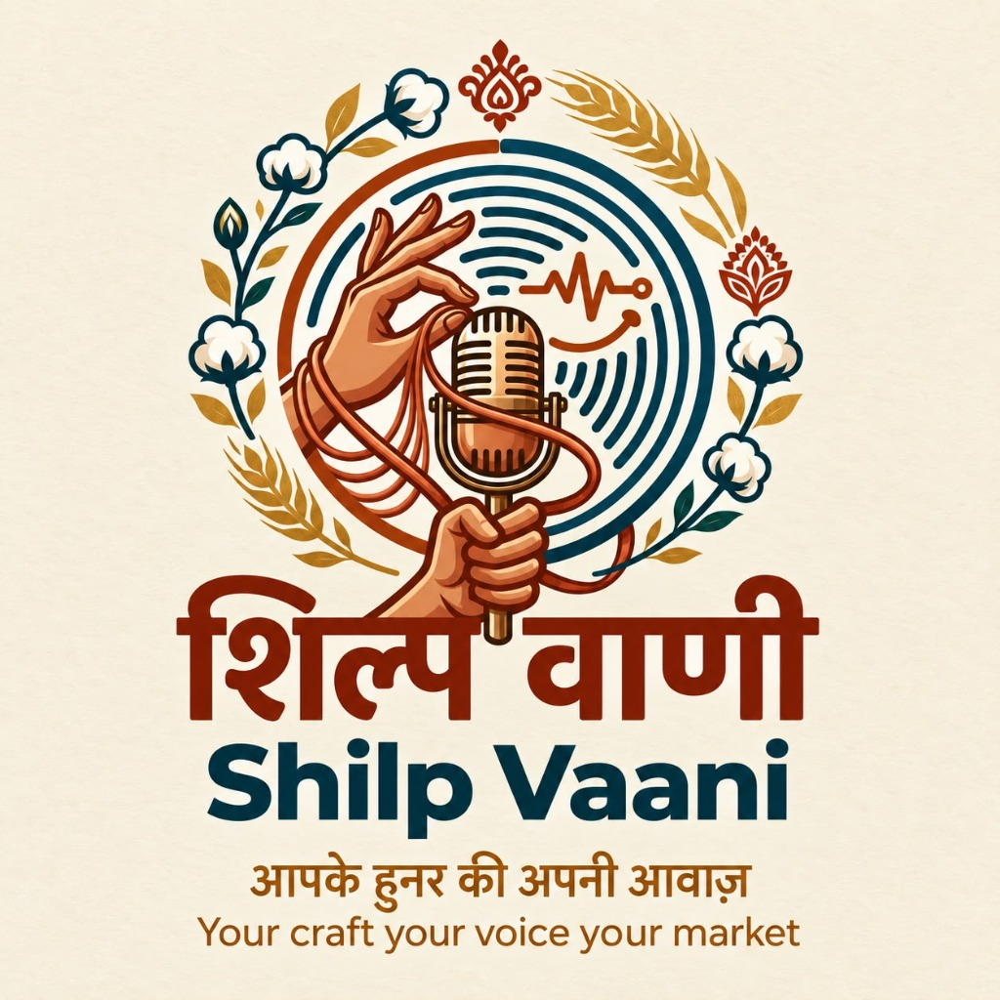

<div align="center">
  

  # ShilpVani (शिल्पवाणी)

  ### Multilingual Voice-First AI for Artisans

  *"We don't ask artisans to learn e-commerce. We use AI to make e-commerce understand artisans."*

  [](file:///d:/SIH2026/tests)
  [-blue.svg)](file:///d:/SIH2026/frontend)
  [](file:///d:/SIH2026/vercel.json)
  [](file:///d:/SIH2026/README.md)
</div>

---

## 🌟 Product Positioning

**ShilpVani (शिल्पवाणी)** is a **multilingual, voice-first AI platform** that helps rural and marginalized artisans turn their craft into professional digital catalogues and connect directly with B2B wholesale buyers.

> **Core Innovation**: Reducing the language and digital-literacy barrier between artisans and digital commerce through multilingual, voice-first AI.

---

## 🌐 Multilingual AI Platform

ShilpVani is designed as a **multilingual AI platform** rather than a single language-specific marketplace.

### Supported Interface Languages (Current Prototype)

The current prototype provides complete interface support, speech recognition routing, and translation parity across **seven Indian languages**:

1. **English** (`en`) — English
2. **Hindi** (`hi`) — हिन्दी
3. **Bengali** (`bn`) — বাংলা
4. **Marathi** (`mr`) — मराठी
5. **Assamese** (`as`) — অসমীয়া
6. **Tamil** (`ta`) — தமிழ்
7. **Telugu** (`te`) — తెలుగు

> *Architecture Note*: The current prototype supports 7 Indian languages, with an underlying software and model orchestration architecture designed for further multilingual expansion across additional Indic dialects.

---

## 🔁 The AI Product Story & Journey

```text
ARTISAN SPEAKS NATURALLY
   │ (Voice note in native language + Craft Photo)
   ▼
MULTILINGUAL INPUT & SPEECH RECOGNITION
   │ (Speech-to-text + Regional dialect parsing)
   ▼
AI UNDERSTANDS THE CRAFT
   │ (Extracts material, dimensions, duration, heritage story)
   ▼
STRUCTURED PRODUCT DATA & IMAGE ENHANCEMENT
   │ (Bilingual descriptions + Studio lighting backdrop + Fair wage estimation)
   ▼
PROFESSIONAL DIGITAL CATALOGUE
   │ (High-conversion marketplace listing)
   ▼
B2B MARKETPLACE & BULK ORDERS
   │ (Direct wholesale buyer discovery & order lifecycle tracking)
```

---

## 🚨 Problem Statement

Rural and marginalized artisans across India produce exquisite handcrafted heritage items but face severe systemic barriers to online commercial marketplaces:

* **Language Barriers**: E-commerce platforms are overwhelmingly English/Hindi-centric, excluding regional dialect speakers.
* **Digital Literacy Deficit**: Form-heavy listing tools require typing, categorization codes, and complex administrative inputs.
* **Cataloguing Friction**: Writing persuasive marketing text, cultural background, dimensions, and maintenance care instructions is challenging without formal marketing training.
* **Sub-par Product Photography**: Photographs taken on basic smartphones under poor lighting fail to attract urban and international buyers.
* **Pricing Uncertainty**: Artisans often underprice their labor or lack cost-plus pricing frameworks, leading to economic exploitation.
* **Limited Access to B2B Markets**: High dependency on local middlemen, physical seasonal fairs, and regional traders limits income stability.

---

## ✨ Key Implemented Capabilities

* 📷 **AI Image Studio / Image Enhancement**: Auto-corrects mobile captures with lighting balance, edge-preserving studio background cleanup, and SHA-256 hashed asset serving under `/enhanced`.
* 🎙️ **Voice-First Product Input**: Tap-to-record voice interface supporting regional speech inputs.
* 🗣️ **Multilingual Auto-Cataloguing**: Translates raw artisan voice notes into structured, professional marketing copy, heritage stories, and care guidelines.
* 🌐 **Multilingual Interface & Localisation**: Verified translation dictionary parity (66 keys each) across English, Hindi, Bengali, Marathi, Assamese, Tamil, and Telugu.
* 💰 **AI-Assisted Suggested Pricing**: Cost-plus pricing algorithm consuming raw material cost, labor hours, production duration, and regional multipliers providing an *AI-assisted suggested price range*.
* 🏢 **B2B Wholesale Marketplace**: Dedicated buyer feed for discovering published artisan products, submitting bulk order requests, and negotiating custom unit prices.
* 📦 **Order Status Tracking**: Persisted order lifecycle state management (`pending` → `accepted` → `fulfilled`).
* 📜 **Cultural Narrative Preservation**: Highlights traditional craft techniques, heritage stories, and human artisan identity.

---

## 🧠 AI Pipeline Architecture

1. **Voice Processing & Multilingual NLP (`ai/nlp/voice_and_story.py`)**:
   * Speech-to-text transcription parsing native dialect speech.
   * Keyword & entity extraction for dimensions, production duration, material type, and craft category.
   * Grounded narrative generation without hallucinating unstated artisan facts.
2. **Vision & Image Enhancement (`ai/vision/image_enhancer.py`)**:
   * EXIF orientation auto-normalization for smartphone photos.
   * Non-destructive studio backdrop enhancement & lighting balance.
   * Content-hash collision protection with static asset serving under `/enhanced`.
3. **AI-Assisted Dynamic Pricing (`ai/pricing/smart_pricing.py`)**:
   * Cost-plus pricing algorithm consuming raw material cost, labor hours, production duration, and regional multipliers.
   * Outputs an **AI-assisted suggested price range** (labeled clearly with a disclaimer; does not guarantee absolute market value).
4. **Product Pipeline Orchestration (`backend/app/services/orchestrator.py`)**:
   * Chains NLP, Vision, and Pricing submodules with step-level fallback isolation, ensuring system resilience even if individual AI steps encounter partial data.

---

## 🚀 Vercel & Cloud Deployment Architecture

ShilpVani uses a decoupled frontend/backend deployment model optimized for performance, scalability, and state persistence:

```text
┌────────────────────────────────────────────────────────┐
│                   Vercel CDN Edge Network              │
│  React 18 + Vite 6 Single Page App (SPA)               │
│  - Static Asset Distribution & Global Edge Caching     │
│  - Environment: VITE_API_BASE_URL                      │
│  - Config: vercel.json (Root & frontend/ vercel.json)   │
└───────────────────────────┬────────────────────────────┘
                            │ API Calls / CORS
                            ▼
┌────────────────────────────────────────────────────────┐
│               FastAPI Backend Cloud Host               │
│  Python 3.12 + FastAPI + SQLite3                       │
│  - Host: Render / Railway / Fly.io / AWS EC2            │
│  - Persistent SQLite Database (tantu.db)               │
│  - Persistent Image Uploads & /enhanced Studio Assets  │
└────────────────────────────────────────────────────────┘
```

### Vercel Frontend Configuration

* **Build Command**: `npm run build --prefix frontend` (or `npm run build` inside `frontend/`)
* **Output Directory**: `frontend/dist` (or `dist` inside `frontend/`)
* **Environment Variable**: `VITE_API_BASE_URL` (points to live FastAPI backend; defaults to local development server when unset).
* **Configuration Files**: Root [`vercel.json`](file:///d:/SIH2026/vercel.json) and [`frontend/vercel.json`](file:///d:/SIH2026/frontend/vercel.json) included in repository.

---

## 📊 SIH Prototype Readiness: ~70–75%

### Core Capabilities Implemented (70–75%)
* ✅ **Multilingual interface & localization architecture** (7 Indic languages)
* ✅ **Voice-first artisan input & transcription routing**
* ✅ **AI-assisted catalogue generation & grounded narrative synthesis**
* ✅ **Studio image enhancement & non-destructive processing**
* ✅ **AI-assisted fair pricing estimation**
* ✅ **B2B marketplace discovery feed**
* ✅ **Bulk-order request submission & quantity pricing**
* ✅ **Order lifecycle state persistence** (`pending` → `accepted` → `fulfilled`)
* ✅ **Cloud-deployment readiness & Vercel configuration**

### Future Scope & Production Roadmap (25–30%)
* 🔮 **Additional Indian Languages**: Expanding voice recognition and NLP models to cover Bhojpuri, Maithili, Odia, Dogri, Santhali, and Khasi.
* 🔮 **Advanced Speech Dialect Models**: Fine-tuning whisper/wav2vec models for noisy rural environments and strong regional accents.
* 🔮 **Real Market-Price Datasets**: Integrating live handicraft export pricing datasets and Ministry of Textiles benchmarks.
* 🔮 **Payment & Escrow Systems**: Integrated UPI/Razorpay payment processing with milestone-based escrow payouts protecting artisan earnings.
* 🔮 **Logistics & Shipping Partnerships**: Automated shipping label generation with regional postal and courier partners for door-to-door artisan pickups.
* 🔮 **ONDC & GeM Network Connectors**: Direct integration with Open Network for Digital Commerce (ONDC) and Government e-Marketplace (GeM).
* 🔮 **Phygital Onboarding**: Partnering with Self-Help Groups (SHGs) and NGO cluster leads to onboard non-smartphone artisans through digital champions.

---

## 🛠️ Technology Stack

| Layer | Technology | Details |
|---|---|---|
| **Frontend UI (Vercel)** | React 18 + Vite 6 | SPA with CSS variables, glassmorphism, responsive grid & mobile bottom nav |
| **Backend Framework** | Python 3.12 / FastAPI | Asynchronous REST API server with Pydantic v2 schemas |
| **Database & Persistence** | SQLite 3 (`tantu.db`) | Relational persistence with raw parameterization & auto-seeding |
| **AI & NLP Processing** | Python 3.12 / RegEx / PIL | Devanagari/Indic script digit normalization, PIL image transformation |
| **Icons & Typography** | Lucide React / Google Fonts | Outfit, Noto Sans Devanagari, Rozha One |
| **Testing Suite** | Python `unittest` | Automated backend, NLP, vision, pricing & contract regression tests |

---

## 👥 Team Members & Credits

| Member | Name | Technical Role & Responsibilities |
|---|---|---|
| **A** | **Abhishek Shukla** | **Tech Lead + Backend + Integration** — Core Architecture, FastAPI, SQLite, Schemas, Orchestrator & Master Integration |
| **P** | **Pratistha** | **Frontend / Mobile UI** — Mobile-first React UI, Artisan Wizard, Buyer Feed & Responsive Design System |
| **M** | **Manyata** | **AI / NLP + Voice + Multilingual Intelligence** — Voice Transcription, Indic Script NLP Parsing & 7-Language Parity |
| **R** | **Raj** | **Computer Vision + Image Enhancement** — Background Removal, Studio Lighting & Image Asset Delivery |
| **S** | **Sanskriti** | **Dynamic Pricing + B2B Marketplace** — Cost-Plus Pricing Engine, Volume Multipliers & Wholesale Order Requests |
| **Parth** | **Parth** | **Database + Testing + QA / Integration Support** — Unit & Integration Test Suite, Database Reliability & QA Auditing |

---

## ⚡ Setup & Installation Guide

### Prerequisites
* Python 3.10+ (Python 3.12 recommended)
* Node.js 18+ and `npm`

### 1. Clone & Setup Backend
```bash
git clone https://github.com/abhi03241/tantu-sih-26090.git
cd tantu-sih-26090
git checkout feature/A-backend

python -m pip install -r backend/requirements.txt
python -m backend.app.main
```
* Backend URL: `http://localhost:8000`
* Interactive API Documentation (Swagger): `http://localhost:8000/docs`

### 2. Setup & Run Frontend
```bash
cd frontend
npm install
npm run dev
npm run build
```

---

## 🧪 Automated Testing & Verification

```bash
# Run full python unittest suite
python -m unittest discover -s tests -p "test_*.py" -v
```

### Verified Test Results:
* **Backend & Integration Unittests**: **62/62 PASSED** (0 failures, 0 errors in 1.89s).
* **Frontend Production Build**: `npm run build --prefix frontend` **PASSED** (1610 modules transformed in 1.56s, 0 build errors).
* **Git Whitespace & Format Check**: `git diff --check` **PASSED** (0 whitespace/formatting issues).

---

<div align="center">
  <b>Developed for Smart India Hackathon (SIH 2026) — Problem Statement 26090</b>
</div>
